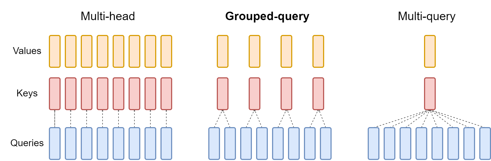

# GQA (Grouped Query Attention)

Grouped Query Attention uses 1 key and 1 value head for grouped query which is between multi-head and multi-query the diagram below explaings this. GQA is a method proposed to reduce the memory bandwidth overhead from keys and values.



When converting Multi-head checkpoint to GQA checkpoint we construct each group key and value head by mean pooling all the original heads with that group.

#### Multi head attention
q-> 32 head
k-> 32 head
v-> 32 head

so for kv cache as the value of the context length increases the memory increases (context_length * kv_head) to mitigate this memory overhead problem MQA was proposed.

#### Multi Query Attention
q-> 32 head
k-> 1 head
v-> 1 head

we used 1 head for all the query this reduces the memory drastically but the quality drops as well.

#### Grouped Query Attention
q-> 32 head
k-> 8 head
v-> 8 head

so for each head we use 4 query this preserves most of the model quality while reducing the KV cache size.

Queries

Q0
Q1
Q2
Q3
  \
   -> KV0

Q4
Q5
Q6
Q7
  \
   -> KV1

Q8
Q9
Q10
Q11
   \
    -> KV2

Meta Llama 2, Meta Llama 3, Mistral AI use this GQA

#### Full Forward pass for a GQA

```
q = self.q_proj(x)
k = self.k_proj(x)
v = self.v_proj(x)

q = q.view(B,T,n_heads,head_dim)
k = k.view(B,T,n_kv_heads,head_dim)
v = v.view(B,T,n_kv_heads,head_dim)

q = apply_rope(q)
k = apply_rope(k)

k = repeat_kv(
    k,
    n_heads // n_kv_heads
)

v = repeat_kv(
    v,
    n_heads // n_kv_heads
)

attn = F.scaled_dot_product_attention(
    q.transpose(1,2),
    k.transpose(1,2),
    v.transpose(1,2),
    is_causal=True
)
```