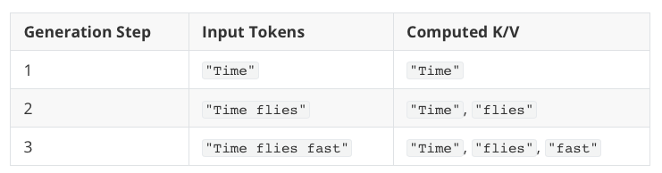
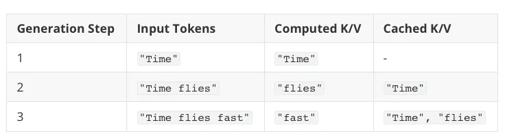

# KV Cache

### Overview

KV cache stores the intermediate key and value computations for reuse during inference this results substantial speed up in text generation. The downside of KV Cache is add more complexity to code and memory requirements increases and cannot be used during training. But the speed increase in text generation is well worth the trade-offs in code complexity and memory when using LLMs in production.
The LLM predict the next work using the previous tokens as an input so when we generate the next token the k and v matrix are computated again for the previous token we can store this computations in a cache and reuse it.

LLMs Generating text without KV Cache

LLMs Generating text with KV Cache
### Practical Questions

1. We do not store the query values because the query is needed for the current token, while keys and values are needed for future tokens.
2. Intution is assume a library is attention so query is the indivdual query "where is the book ?" which is for the current user but the key is the metadata of the book which will be needed in future computations as well as value is the content of the book which will be needed in the future.
3. Complexity improvement is $O(N^2)$ to $O(N)$

### Implementation

1. Query q1 requires k1 and v1 we compute them and store (k1,v1)
2. Query q2 requires k1, k2 and v1,v2 we compute q2, k2, v2 and use the existing (k1, v1) and then store (k2,v2) to cache.
3. Every query only participates in calculating the attention output for its own token.

Modifying the attention layer

We only calculate the values on a new token
$$q_{new} = x_{new} @ W_q$$
$$k_{new} = x_{new} @ W_k$$
$$v_{new} = x_{new} @ W_v$$

$$k_{cache} = torch.cat([k_{cache}, k_{new}], dim = 1)$$
$$v_{cache} = torch.cat([v_{cache}, v_{new}], dim = 1)$$

$$attn = (q_{new} * k_{cache}^T)$$

$$attn = softmax(attn)$$
$$out = attn @ v_{cache}$$