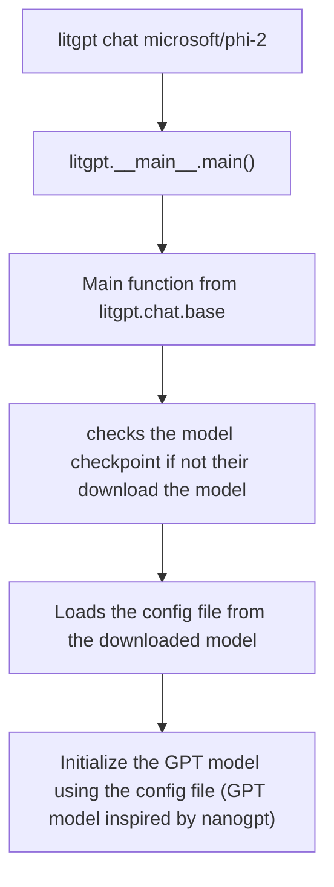

### Litgpt chat model-name

#### Steps executed when running the above command

```mermaid
flowchart TD
    A[litgpt chat microsoft/phi-2] --> B["litgpt.__main__.main()"]
    B --> C["Main function from litgpt.chat.base"]
    C --> D["checks the model checkpoint if not their download the model"]
    D --> E["Loads the config file from the downloaded model"]
    E --> F["Initialize the GPT model using the config file (GPT model inspired by nanogpt)"]
```
